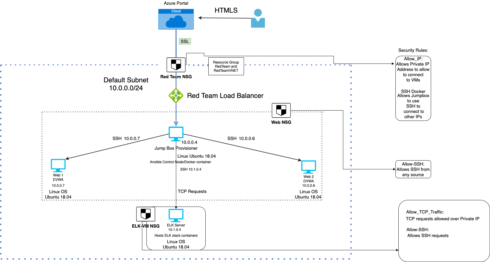
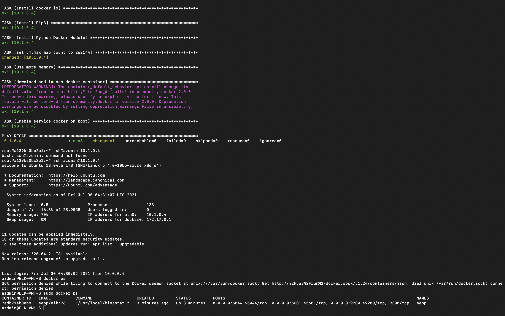

## Automated ELK Stack Deployment

The files in this repository were used to configure the network depicted below.

These files have been tested and used to generate a live ELK deployment on Azure. They can be used to either recreate the entire deployment pictured above. Alternatively, select portions of the Ansible playbook file may be used to install only certain pieces of it, such as Filebeat.

  - [Ansible-Playbook](Ansible)

This document contains the following details:
- Description of the Topology
- Access Policies
- ELK Configuration
  - Beats in Use
  - Machines Being Monitored
- How to Use the Ansible Build

### Description of the Topology

The main purpose of this network is to expose a load-balanced and monitored instance of DVWA, the D*mn Vulnerable Web Application.

Load balancing ensures that the application will be highly available, in addition to restricting unnecessary traffic to the network. Load Balancers protect the integrity of a server by preventing server overloads from unnecessary or malicious traffic. Using a jump box allows the user to jump between other servers without having to login.

Integrating an ELK server allows users to easily monitor the vulnerable VMs for changes to the Network and system files.

- File-beat monitors log files and log events.
- Metric Beat collects statistics and data and exports the data to applications such as Elasticsearch or Logstash.

The configuration details of each machine may be found below.

| Name    | Function       | IP Address | Operating System |
|---------|----------------|------------|------------------|
| Jumpbox | Gateway        | 10.0.0.4   | Linux            |
| Web 1   | DVWA           | 10.0.0.7   | Linux            |
| Web 2   | DVWA           | 10.0.0.6   | Linux            |
| ELK     | Logging Server | 10.1.0.4   | Linux            |     

The machines on the internal network are not exposed to the public Internet. 

Only the Jumpbox machine can accept connections from the Internet. Access to this machine is only allowed from the following IP addresses:
- 71.193.252.208

Machines within the network can only be accessed by SSH.

- I allowed Jumpbox to access ELK VM; the IP of jumpbox server was 10.0.0.4

A summary of the access policies in place can be found in the table below.
| Name    | Publicly Accessible | Allowed IP Addresses |
|---------|---------------------|----------------------|
| Jumpbox | Yes                 | 71.193.252.208       |
| Web 1   | No                  | All IPs              |
| Web 2   | No                  | All IPs              |
| ELK     | No                  | 10.0.0.4             |
### Elk Configuration

Ansible was used to automate configuration of the ELK machine. No configuration was performed manually, which is advantageous because...

The main reason to automate with Ansible is it allows you to deploy it across multiple virtual machines instead of having to configure it for every single one manually.

The playbook implements the following tasks:

- Install docker.io
- Install Pip3 (python3)
- Install Python Docker Module
- Increase memory use
- Set docker container to launch and restart

The following screenshot displays the result of running `docker ps` after successfully configuring the ELK instance.

### Target Machines & Beats
This ELK server is configured to monitor the following machines:

- Web 1: 10.0.0.7
- Web 2: 10.0.0.6

We have installed the following Beats on these machines:
Metric beat as well as File beat were downloaded

These Beats allow us to collect the following information from each machine:

- Filebeats collects log events and the sends it to Elasticsearch or Logstash.

- Metricbeat collects metric data, such as operating system metrics like CPU, or any data related to services running on the server. It also can log other beats and the entire ELK stack.

### Using the Playbook
In order to use the playbook, you will need to have an Ansible control node already configured. Assuming you have such a control node provisioned: 

SSH into the control node and follow the steps below:
- Copy the ansible.cfg file to /etc/ansible/
- Update the hosts file to include the ip that you wish for ansible to run on as well as what language to use (In this scenario python3)
- Run the playbook, and navigate to Kibana to check that the installation worked as expected.
